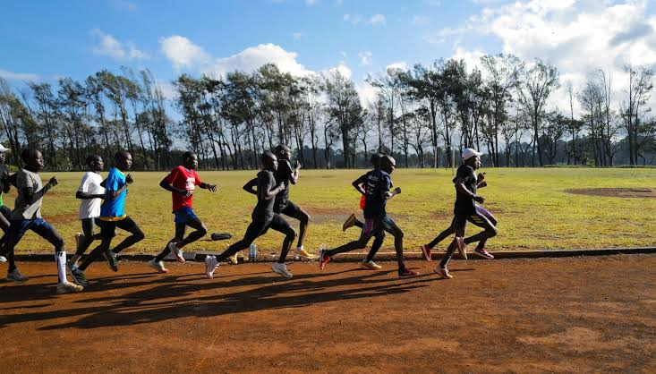

=== "1. Interwały"
    Celem tego treningu jest nauczenie organizmu pracy przy wysokim stężeniu kwasu mlekowego.

    * **Dla kogo:** Zaawansowani (przygotowanie do startu docelowego).
    * **Przykład dla 800m:** * 6 x 200 metrów w tempie startowym na 800m.
      * Przerwa: 2 minuty marszu pomiędzy odcinkami.
    * **Przykład dla 1500m:**
      * 10 x 400 metrów w tempie startowym na 1500m.
      * Przerwa: 60-90 sekund truchtu.
    

    
    

=== "2. Fartlek"
    Trening o zmiennym tempie, idealny na budowanie bazy przed sezonem, wykonywany w terenie (las, park) zamiast na bieżni.

    * **Przykład (Piramida):**
      * 10 minut spokojnej rozgrzewki.
      * Zmiany tempa: 1 min szybko / 1 min wolno, 2 min szybko / 2 min wolno, 3 min szybko / 3 min wolno, a następnie powrót "w dół" piramidy (2 min, 1 min).
      * 10 minut schłodzenia (trucht).

    

    
    

=== "3. Podbiegi"
    Buduje siłę mięśni nóg, dynamikę odbicia oraz poprawia technikę kroku biegowego.

    * **Wykonanie:**
      * Znajdź wzniesienie o łagodnym nachyleniu (ok. 5-8%).
      * Wykonaj 10 dynamicznych podbiegów trwających 15-20 sekund.
      * Wracaj na start spokojnym marszem (pełen wypoczynek przed kolejnym powtórzeniem).
      * Zwróć szczególną uwagę na wysoką pracę kolan i aktywną pracę rąk.

=== "4. Bieg Ciągły (BC2)"
    Buduje fundamenty wytrzymałości specjalnej, przesuwa próg mleczanowy i uczy organizm efektywnego utylizowania kwasu mlekowego. Jest to bieg w tzw. strefie "komfortowo-trudnej".

    * **Dla kogo:** Wszyscy biegacze (kluczowy element budowania bazy tlenowej i wytrzymałości tempowej).
    * **Wykonanie:**
      * Intensywność powinna oscylować wokół 75-85% tętna maksymalnego. Oddech jest wyraźnie przyspieszony, ale biegacz powinien być w stanie wypowiedzieć krótkie zdanie (nie łapie zadyszki).
      * Zbyt szybkie bieganie tego treningu zamienia go w zawody i niszczy jego sens fizjologiczny.
    * **Przykłady:**
      * **Ciągły:** 6 do 8 kilometrów stałym, żwawym tempem (poprzedzone 2 km spokojnej rozgrzewki i zakończone 1 km schłodzenia).
      * **Dzielony (dla początkujących):** 3 x 2 kilometry w tempie BC2, z przerwą 2 minuty w spokojnym truchcie.
      
    

    
    

=== "5. Double Threshold"
    Jest to innowacyjna i niezwykle skuteczna ewolucja treningu progowego, spopularyzowana w ostatnich latach przez tzw. "szkołę norweską" (m.in. braci Ingebrigtsen). Polega na wykonaniu dwóch objętościowych jednostek treningowych na progu mleczanowym w ciągu zaledwie jednego dnia.

    * **Dla kogo:** **WYŁĄCZNIE DLA ZAWODNIKÓW ZAAWANSOWANYCH ORAZ ELITY.** Próba wdrożenia tego systemu przez amatorów bez wieloletniej bazy tlenowej, perfekcyjnej regeneracji i stałego monitorowania stężenia kwasu mlekowego we krwi najczęściej kończy się szybkim przetrenowaniem, wypaleniem układu nerwowego lub kontuzją.
    * **Cel i Działanie:** Pozwala na spędzenie ogromnej ilości czasu (nawet 15-20 km) w docelowych strefach przemian tlenowych w trakcie jednego dnia, bez drastycznego uszkadzania mięśni, co miałoby miejsce przy jednej, ciągłej, wyczerpującej sesji.
    * **Przykład (Dzień treningowy Double Threshold):**
      * **Rano (niższy próg):** 5 x 1200m z przerwą 60 sekund w tempie biegu na 10 km do półmaratonu (kwas mlekowy kontrolowany na poziomie ok. 2.0 - 2.5 mmol/L).
      * **Popołudnie/Wieczór (wyższy próg):** 10 x 400m z krótką przerwą 30-45 sekund, biegane szybciej, w tempie wyścigu na 5 km (kwas mlekowy kontrolowany na poziomie ok. 3.0 - 3.5 mmol/L).
    

    
    
