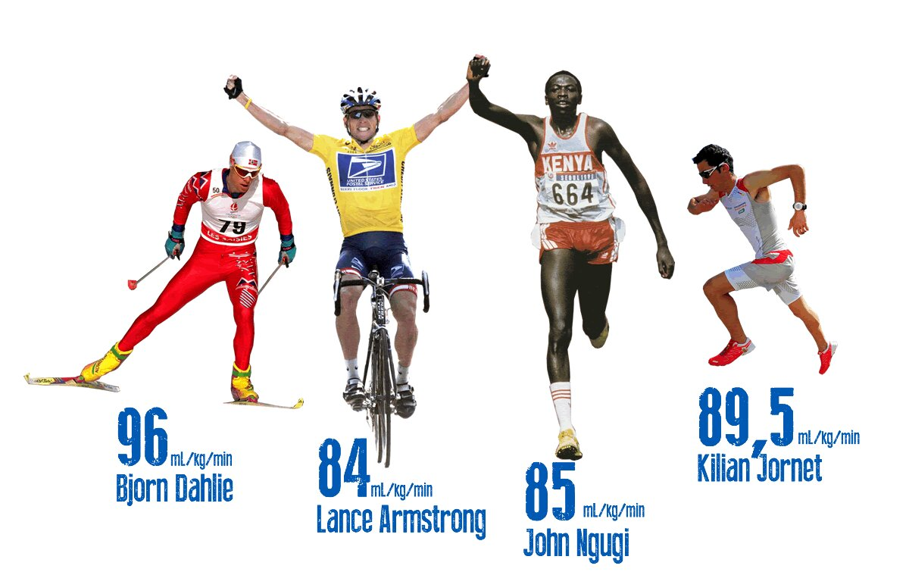

# Teoria - Fizjologia i Mechanika Biegu

Zrozumienie procesów zachodzących w organizmie podczas wysiłku pozwala na zoptymalizowanie treningu i unikanie kontuzji. W tej sekcji omawiamy fundamentalne pojęcia fizjologiczne oraz kluczowe aspekty techniki poruszania się po bieżni.

## Systemy Energetyczne

Podczas biegu na średnich dystansach organizm korzysta z dwóch głównych szlaków metabolicznych:

1. **Przemiany beztlenowe (anaerobowe):**
   Główne źródło energii na dystansie 800m. Organizm produkuje energię bez udziału tlenu, co prowadzi do gwałtownego gromadzenia się kwasu mlekowego we krwi. Trenowanie tego systemu pozwala na znoszenie narastającego bólu mięśni i utrzymanie wysokiej prędkości na finiszu.
2. **Przemiany tlenowe (aerobowe):**
   Fundament każdego biegacza. Kształtowane poprzez długie, spokojne wybiegania (tzw. bazę tlenową). Im lepsza wydolność tlenowa, tym organizm skuteczniej utylizuje kwas mlekowy podczas szybszego biegu. Na dystansie 1500m system tlenowy dostarcza już ponad połowę całkowitej energii.

## Pułap Tlenowy (VO2max)

Kluczowy parametr w sportach wytrzymałościowych. Oznacza maksymalną ilość tlenu, jaką organizm potrafi pochłonąć w ciągu minuty (najczęściej podawany w mililitrach na kilogram masy ciała na minutę). Zawodnicy biegający na średnich dystansach posiadają jedne z najwyższych wskaźników VO2max na świecie.

## Próg Mleczanowy (Lactate Threshold - LT)

Próg mleczanowy to poziom intensywności wysiłku, powyżej którego kwas mlekowy zaczyna gwałtownie kumulować się we krwi, a organizm nie nadąża z jego bieżącą utylizacją. 

* **Strefa podprogowa:** Bieg jest komfortowy, organizm bez problemu na bieżąco usuwa powstające metabolity.
* **Punkt przegięcia (Próg):** Zazwyczaj występuje przy stężeniu około 4.0 mmol/L kwasu mlekowego we krwi u osób trenujących. 
* **Zastosowanie w treningu:** Przesunięcie tego progu "w prawo" (czyli do wyższych prędkości) pozwala biegaczowi biec znacznie szybciej przy zachowaniu pełnej kontroli nad zmęczeniem. Na tym mechanizmie opierają się opisane w zakładkach treningi drugiego zakresu (BC2) oraz system Double Threshold.

## Mechanika Biegowa i Kinematyka Kroku

Wybitna wydolność krążeniowo-oddechowa nie przyniesie rezultatów, jeśli technika biegu będzie nieefektywna energetycznie. Na dystansach średnich każdy szczegół ruchu ma znaczenie.

### Kadencja a Długość Kroku
Prędkość biegacza zależy od prostego wzoru: Prędkość = Kadencja × Długość Kroku.
* **Kadencja (częstotliwość):** Liczba kroków wykonywanych w ciągu minuty. Elita średniodystansowców na końcowych metrach osiąga kadencję przekraczającą 200, a nawet 210 kroków na minutę.
* **Długość kroku:** Wynika bezpośrednio z siły odbicia i elastyczności mięśniowej. Należy jednak uważać na zbyt dalekie wyrzucanie nogi przed środek ciężkości (tzw. *overstriding*) – działa to jak hamulec i drastycznie obciąża stawy kolanowe.

### Praca Rąk i Postawa Ciała
W biegach średnich ramiona nie służą tylko do utrzymywania równowagi (jak w maratonie), ale stanowią aktywny napęd dla nóg:
* Kąt zgięcia w łokciu powinien wynosić stale około 90 stopni.
* Ruch odbywa się wahadłowo w stawie barkowym – dłonie w fazie przedniej wędrują niemal na wysokość brody, a w fazie tylnej mijają biodro.
* Sylwetka powinna być delikatnie pochylona do przodu, ale z biodrami uniesionymi wysoko (tzw. "bieganie na wysokich biodrach"), co ułatwia optymalne lądowanie na śródstopiu.

## Ekonomia Biegowa 

Ekonomia biegowa określa zapotrzebowanie organizmu na tlen przy określonej, podmaksymalnej prędkości biegu. Można ją porównać do spalania paliwa w samochodzie – zawodnik o doskonałej ekonomii zużywa mniej tlenu (energii) na utrzymanie tempa np. 3:00/km niż zawodnik o słabej ekonomii.

Wpływają na nią m.in.:
* **Anatomia:** Długość ścięgna Achillesa i jego zdolność do magazynowania oraz oddawania energii sprężystej przy każdym odbiciu.
* **Antropometria:** Niska masa obwodowa (lekkie łydki i stopy oznaczają mniejszy wydatek energetyczny podczas wahadłowego ruchu nogi).
* **Technologia:** Dobór odpowiedniego obuwia. Współczesne kolce lekkoatletyczne wyposażone w profilowaną płytkę węglową oraz nowoczesne, responsywne pianki potrafią poprawić ekonomię biegową o 3-4%.

## Znaczenie Taktyki (Pacing)

W przeciwieństwie do sprintów, gdzie biegnie się "ile sił w nogach" od samego startu, w biegach średniodystansowych kluczowy jest tzw. *pacing* (umiejętne rozkładanie sił).

* **Negative Split:** Przebiegnięcie drugiej połowy dystansu szybciej niż pierwszej. Strategia bardzo często stosowana w biegach o charakterze czysto taktycznym (np. podczas finałów Igrzysk Olimpijskich).
* **Even Split:** Utrzymywanie idealnie równego tempa przez cały dystans, uznawane przez fizjologów za najbardziej efektywną metodę bicia rekordów życiowych.

> **Ważne:** Na bieżni okólnej (szczególnie na dystansach 800m i 1500m) ogromne znaczenie ma również unikanie biegania po zewnętrznych torach na wirażach. Każde pełne okrążenie pokonane po drugim torze zamiast pierwszego dokłada do dystansu około 7 dodatkowych metrów!